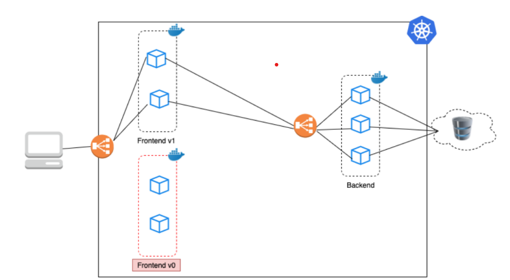

**Universidad de San Carlos de Guatemala**  
**Facultad de Ingeniería**  
**Escuela de Ciencias y Sistemas**  
**Sistemas Operativos 2 - Seccion A**  
**Ing. César Batz Saquimux**

| Carné     | Nombre                          	|
| --------- | ---------------------------------	|
| 201801480 | Cristian Alexander Gómez Guzmán 	|
| 201801351 | Elmer Gustavo Sánchez García      |
| 201800586 | Gerber David Colindres Monterroso |
| 201801229 | Osman Alejandro Pérez López       |

## Manual tecnico

### Contenido

- [Manual tecnico](#manual-tecnico)
	- [Contenido](#contenido)
  - [Arquitectura](#arquitectura)
  - [Instalacion y configuracion de Prometheus y Grafana](#instalacion-y-configuracion-de-prometheus-y-grafana)
      - [Prometheus](#prometheus)
      - [Grafana](#grafana)
  - [Configuracion y Despliegue del sistema con Docker y Kubernetes](#configuracion-y-despliegue-del-sistema-con-docker-y-kubernetes)
    - [Kubernetes](#kubernetes)
    - [Docker](#docker)
    - [Archivos YAML](#archivos-yaml)
  - [Glosario](#glosario)


### Arquitectura

<p align="center"></p>

## Instalacion y configuracion de Prometheus y Grafana

#### Prometheus

Es un software de monitoreo que se integra con una amplia gama de sistemas de forma nativa o mediante el uso de complementos. Puede extraer métricas de trabajos directamente o, para trabajos de corta duración, mediante el uso de una puerta de enlace push cuando finaliza el trabajo.

Intalacion
```powerShell
# creando directorio
sudo mkdir Observabilidad
cd Observabilidad

# instalando herramienta wget
sudo apt install wget
# obtener repositorio y descomprimir prometheus
sudo wget https://github.com/prometheus/prometheus/releases/download/v2.32.1/prometheus-2.32.1.linux-amd64.tar.gz
sudo tar xzf prometheus-2.32.1.linux-amd64.tar.gz

# levantar prometheus
cd prometheus-2.32.1.linux-amd64
sudo ./prometheus
Dashboard de Prometheus (IP_VM:9090) -> 35.226.69.115:9090
```

Intalacion de NODE EXPORTER
Node Exporter es un exportador de Prometheus para métricas de nivel de servidor y de SO con recopiladores de métricas configurables. Ayuda a medir varios recursos del servidor, como la RAM, el espacio en disco y la utilización de la CPU.


```powerShell
sudo wget https://github.com/prometheus/node_exporter/releases/download/v1.3.1/node_exporter-1.3.1.linux-amd64.tar.gz
sudo tar xzf node_exporter-1.3.1.linux-amd64.tar.gz

# levantar node_exporter
cd node_exporter-1.3.1.linux-amd64
sudo ./node_exporter
Información de node_exporter (IP_VM:9100) -> 35.226.69.115:9100

```

Aregar node export a Prometheus

```powerShell
# Editar prometheus.yml
sudo nano prometheus.yml

# contenido que se debe agregar
  - job_name: "node_exporter"
    static_configs:
      - targets: ["localhost:9100"]

# verificar que exista node exporter en Prometheus
Levantar servidor de prometheus
```

#### Grafana

Es una aplicación web de visualización interactiva y analítica de código abierto. Permite ingerir datos de una gran cantidad de fuentes de datos, consultar estos datos y mostrarlos en gráficos personalizables para un análisis fácil.

```powershell
# obtener repositorio y descomprimir
sudo wget https://dl.grafana.com/enterprise/release/grafana-enterprise-8.3.3.linux-amd64.tar.gz
sudo tar -zxvf grafana-enterprise-8.3.3.linux-amd64.tar.gz

# levantar grafana
cd grafana-8.3.3
cd bin
sudo ./grafana-server
Información de grafana (IP_VM:3000) -> 35.226.69.115:3000
# usuario: admin contraseña: admin

# Agregando DataSource Prometheus
http://localhost:9090

# Importando Dashboard: Importar y poner el id 1860
https://grafana.com/grafana/dashboards/1860

# Ver resultado final en Grafana
http://35.226.69.115:3000/d/rYdddlPWk/node-exporter-full?orgId=1&refresh=5s&from=now-5m&to=now
```


## Configuracion y Despliegue del sistema con Docker y Kubernetes

#### Docker
Es un proyecto de código abierto que automatiza el despliegue de aplicaciones dentro de contenedores de software, proporcionando una capa adicional de abstracción y automatización de virtualización de aplicaciones en múltiples sistemas operativos.

Docker File Social App
```dockerfile
FROM node:alpine

# create & set working directory
RUN mkdir -p /usr/src
WORKDIR /usr/src

# copy source files
COPY . /usr/src

# install dependencies
RUN npm install

# start app
RUN npm run build
EXPOSE 3000
CMD npm run start
```

Docker File server
```dockerfile
FROM golang:1.16.2-alpine3.13
WORKDIR /app/src
ENV GOPATH=/app
COPY go.mod /app/src
RUN go mod download
COPY . /app/src
EXPOSE 4000
CMD ["go", "run", "main.go"]
```

#### Kubernetes
Instalacion
```powerShell
    # instalando componentes
	    gcloud components install kubectl

    # obtener archivos de instalación
        curl -fsSL -o get_helm.sh https://raw.githubusercontent.com/helm/helm/master/scripts/get-helm-3
    # agregar permisos al archivo.sh
        chmod 700 get_helm.sh
    # instalar
        ./get_helm.sh
```
Comandos basicos
```powerShell
# Ver cuanto cpu esta usando
    kubectl top nodes

# ver pods
    kubecl get pods -n <namespace>

# ver los servicios
    kubectl get services -n <namespace>

# mostrar logs 
    kubectl logs -f deploy/<mydeploy> -n <namescace>

# aplicar todo los archivos YAML en la ruta actual
    kubectl apply -f ./

# creación de namespace
    kubectl create ns <namespace>
```
Agregar NGINX
```powerShell
# instala 2 servicios: 1 LoadBalancer y 1 o 2 pods.
    helm repo add ingress-nginx https://kubernetes.github.io/ingress-nginx
    helm repo update
    helm install nginx-ingress ingress-nginx/ingress-nginx -n <namespace>

# considerar EXTERNAL-IP de LoadBalancer se usará más adelante
    kubectl get services -n <namespace>
```
Inyectando deployment del nginx-ingres
```powerShell
    kubectl get deployments -n <namespace>

# inyectando
    kubectl get deployment nginx-ingress-ingress-nginx-controller -n <namespace>  -o yaml | linkerd inject - | kubectl apply -f -

# se creó un container hijo
    kubectl get pods -n project

# obtener IP
    kubectl get svc -n <namespace>
```


### Archivos YAML

Deployment
Se usa para decirle a Kubernetes cómo crear o modificar instancias de los pods que contienen una aplicación en contenedores. Se especifica el nombre, número de replicas y la parte más importante es la de los contenedores en donde se hace referencia a la imagen de DockerHub que pertenece a dicho Deployment.

```yaml
apiVersion: apps/v1
kind: Deployment
metadata:
  name: backend-sopes-deployment
spec:
  selector:
    matchLabels:
      role: backend-sopes-deployment
  replicas: 3
  template:
    metadata:
      labels:
        role: backend-sopes-deployment
    spec:
      containers:
      - name: backen-sopes
        image: osmanpl9610/backend_v6:latest
        ports:
        - containerPort: 4000
---
apiVersion: v1
kind: Service
metadata:
  name: backend-sopes-service
spec:
  ports:
  - port: 4000
    targetPort: 4000
    protocol: TCP
  selector:
    role: backend-sopes-deployment
---
apiVersion: apps/v1
kind: Deployment
metadata:
  name: frontend-sopes-deployment
spec:
  selector:
    matchLabels:
      role: frontend-sopes-deployment
  replicas: 2
  template:
    metadata:
      labels:
        role: frontend-sopes-deployment
    spec:
      containers:
      - name: backen-sopes
        image: osmanpl9610/frontend_v5:latest
        ports:
        - containerPort: 3000
---
apiVersion: v1
kind: Service
metadata:
  name: frontend-sopes-service
spec:
  type: LoadBalancer
  ports:
  - port: 3000
    targetPort: 3000
  selector:
    role: frontend-sopes-deployment
---

```

Ingress
```yaml
apiVersion: networking.k8s.io/v1
kind: Ingress
metadata:
  name: minimal-ingress
  annotations:
    kubernetes.io/ingress.class: nginx
    nginx.ingress.kubernetes.io/rewrite-target: /
    nginx.ingress.kubernetes.io/cors-allow-origin: "http://pagina-web.35.226.69.115.nip.io"
    nginx.ingress.kubernetes.io/cors-allow-credentials: "true"
    nginx.ingress.kubernetes.io/cors-allow-methods: POST, OPTIONS, GET, PUT, DELETE
    nginx.ingress.kubernetes.io/cors-allow-headers: Accept, Authorization, Content-Type, Content-Length, X-CSRF-Token, Token, session, Origin, Host, Connection, Accept-Encoding, Accept-Language, X-Requested-With
  namespace: sopes-proyecto2
spec:
  rules:
  - host: backend.35.226.69.115.nip.io
    http:
      paths:
      - path: /
        pathType: Prefix
        backend:
          service:
            name: backend-sopes-service
            port:
              number: 4000
---

apiVersion: networking.k8s.io/v1
kind: Ingress
metadata:
  name: minimal-ingress-v2
  annotations:
    kubernetes.io/ingress.class: nginx
    nginx.ingress.kubernetes.io/rewrite-target: /
    nginx.ingress.kubernetes.io/cors-allow-origin: "*"
    nginx.ingress.kubernetes.io/cors-allow-credentials: "true"
    nginx.ingress.kubernetes.io/cors-allow-methods: POST, OPTIONS, GET, PUT, DELETE
    nginx.ingress.kubernetes.io/cors-allow-headers: Accept, Authorization, Content-Type, Content-Length, X-CSRF-Token, Token, session, Origin, Host, Connection, Accept-Encoding, Accept-Language, X-Requested-With
  namespace: sopes-proyecto2
spec:
  rules:
  - host: pagina-web.35.226.69.115.nip.io
    http:
      paths:
      - path: /
        pathType: Prefix
        backend:
          service:
            name: frontend-sopes-service
            port:
              number: 3000

---
apiVersion: v1
kind: ConfigMap
metadata:
  name: ingress-backend
  namespace: sopes-proyecto2
data:
 nginx.conf: |-
    events {}
    http {
        server {
          listen 4000;
            location / {
                return 500;
            }
        }
        server {
          listen 3000;
            location / {
                return 500;
            }
        }
    }
```


### Glosario

1. **Kubernetes:** es una plataforma de código abierto que orquesta sistemas de tiempo de ejecución de contenedores en un clúster de recursos de hardware en red, originalmente lo desarrolló Google.
2. **Docker:** Es una plataforma creada con el fin de desarrollar, implementar y ejecutar aplicaciones dentro de contenedores. Lo cual permite a los desarrolladores realizar el empaquetado de nuestras aplicaciones junto a sus  dependencias dentro de una unidades estandarizadas conocidas bajo el término de contenedores de software.
3. **Grafana:** Es una herramienta para visualizar datos de serie temporales. A partir de una serie de datos recolectados se obtiene un panorama gráfico de la situación de una empresa u organización.
4. **Prometheus:** Es un sistema de monitoreo de código abierto basado en métricas. Recopila datos de servicios y hosts mediante el envío de solicitudes HTTP en puntos finales de métricas. Luego, almacena los resultados en una base de datos de series de tiempo y los pone a disposición para análisis y alertas.
